# Raw MS data: `mzR` and `MSnbase`


```
## Warning: replacing previous import 'MSnbase::plot' by 'graphics::plot' when
## loading 'RforProteomics'
```


|   |Data type  |File format   |Data structure               |Package           |
|:--|:----------|:-------------|:----------------------------|:-----------------|
|1  |Raw        |mzXML or mzML |mzRpwiz or mzRramp           |mzR               |
|2  |Raw        |mzXML or mzML |list of MassSpectrum objects |MALDIquantForeign |
|3  |Raw        |mzXML or mzML |MSnExp                       |MSnbase           |
|7  |Peak lists |mgf           |MSnExp                       |MSnbase           |

In this section, we will learn how to read raw data in one of the
commonly used open formats (`mzML`, `mzXML` and `netCDF`) into R using
`mzR` (low level access) and `MSnbase` (higher level abstraction).

## Low level access

The `mzR` package in a direct interface to the
[proteowizard](http://proteowizard.sourceforge.net/) code base. It
includes a substantial proportion of *pwiz*'s C/C++ code for fast and
efficient parsing of these large raw data files.

Let's start by using some raw data files from the `msdata`
package. After loading it, we use the `proteomics()` function to
return the full file names for two raw data files. We will start by
focusing on the second one.


```r
library("msdata")
f <- proteomics(full.names = TRUE)
f
```

```
## [1] "/home/lgatto/R/x86_64-pc-linux-gnu-library/3.6/msdata/proteomics/MRM-standmix-5.mzML.gz"                                                
## [2] "/home/lgatto/R/x86_64-pc-linux-gnu-library/3.6/msdata/proteomics/MS3TMT10_01022016_32917-33481.mzML.gz"                                 
## [3] "/home/lgatto/R/x86_64-pc-linux-gnu-library/3.6/msdata/proteomics/MS3TMT11.mzML"                                                         
## [4] "/home/lgatto/R/x86_64-pc-linux-gnu-library/3.6/msdata/proteomics/TMT_Erwinia_1uLSike_Top10HCD_isol2_45stepped_60min_01-20141210.mzML.gz"
## [5] "/home/lgatto/R/x86_64-pc-linux-gnu-library/3.6/msdata/proteomics/TMT_Erwinia_1uLSike_Top10HCD_isol2_45stepped_60min_01.mzML.gz"
```

```r
(f2 <- grep("20141210", f, value = TRUE))
```

```
## [1] "/home/lgatto/R/x86_64-pc-linux-gnu-library/3.6/msdata/proteomics/TMT_Erwinia_1uLSike_Top10HCD_isol2_45stepped_60min_01-20141210.mzML.gz"
```

The three main functions of `mzR` are

* `openMSfile` to create a file handle to a raw data file
* `header` to extract metadata about the spectra contained in the file
* `peaks` to extract one or multiple spectra of interest. 

Other functions such as `instrumentInfo`, or `runInfo` can be used to
gather general information about a run.

### Demonstration


```r
library("mzR")
ms <- openMSfile(f2)
ms
```

```
## Mass Spectrometry file handle.
## Filename:  TMT_Erwinia_1uLSike_Top10HCD_isol2_45stepped_60min_01-20141210.mzML.gz 
## Number of scans:  7534
```


```r
hd <- header(ms)
dim(hd)
```

```
## [1] 7534   31
```

```r
names(hd)
```

```
##  [1] "seqNum"                     "acquisitionNum"            
##  [3] "msLevel"                    "polarity"                  
##  [5] "peaksCount"                 "totIonCurrent"             
##  [7] "retentionTime"              "basePeakMZ"                
##  [9] "basePeakIntensity"          "collisionEnergy"           
## [11] "ionisationEnergy"           "lowMZ"                     
## [13] "highMZ"                     "precursorScanNum"          
## [15] "precursorMZ"                "precursorCharge"           
## [17] "precursorIntensity"         "mergedScan"                
## [19] "mergedResultScanNum"        "mergedResultStartScanNum"  
## [21] "mergedResultEndScanNum"     "injectionTime"             
## [23] "filterString"               "spectrumId"                
## [25] "centroided"                 "ionMobilityDriftTime"      
## [27] "isolationWindowTargetMZ"    "isolationWindowLowerOffset"
## [29] "isolationWindowUpperOffset" "scanWindowLowerLimit"      
## [31] "scanWindowUpperLimit"
```


```r
head(peaks(ms, 117))
```

```
##          [,1] [,2]
## [1,] 399.9976    0
## [2,] 399.9991    0
## [3,] 400.0006    0
## [4,] 400.0021    0
## [5,] 400.2955    0
## [6,] 400.2970    0
```

```r
str(peaks(ms, 1:5))
```

```
## List of 5
##  $ : num [1:25800, 1:2] 400 400 400 400 400 ...
##  $ : num [1:25934, 1:2] 400 400 400 400 400 ...
##  $ : num [1:26148, 1:2] 400 400 400 400 400 ...
##  $ : num [1:26330, 1:2] 400 400 400 400 400 ...
##  $ : num [1:26463, 1:2] 400 400 400 400 400 ...
```

## Exercise

> Let's extract the index of the MS2 spectrum with the highest base
> peak intensity and plot its spectrum. Is the data centroided or in
> profile mode?

<details>


```r
hd2 <- hd[hd$msLevel == 2, ]
i <- which.max(hd2$basePeakIntensity)
hd2[i, ]
```

```
##      seqNum acquisitionNum msLevel polarity peaksCount totIonCurrent
## 5404   5404           5404       2        1        275    2283283712
##      retentionTime basePeakMZ basePeakIntensity collisionEnergy
## 5404      2751.313   859.5032         354288224              45
##      ionisationEnergy    lowMZ  highMZ precursorScanNum precursorMZ
## 5404                0 100.5031 1995.63             5403    859.1722
##      precursorCharge precursorIntensity mergedScan mergedResultScanNum
## 5404               3          627820480         NA                  NA
##      mergedResultStartScanNum mergedResultEndScanNum injectionTime
## 5404                       NA                     NA    0.03474091
##                                                  filterString
## 5404 FTMS + p NSI d Full ms2 859.50@hcd45.00 [100.00-2000.00]
##                                         spectrumId centroided
## 5404 controllerType=0 controllerNumber=1 scan=5404       TRUE
##      ionMobilityDriftTime isolationWindowTargetMZ isolationWindowLowerOffset
## 5404                   NA                   859.5                          1
##      isolationWindowUpperOffset scanWindowLowerLimit scanWindowUpperLimit
## 5404                          1                  100                 2000
```

```r
pi <- peaks(ms, hd2[i, 1])
plot(pi, type = "h")
```

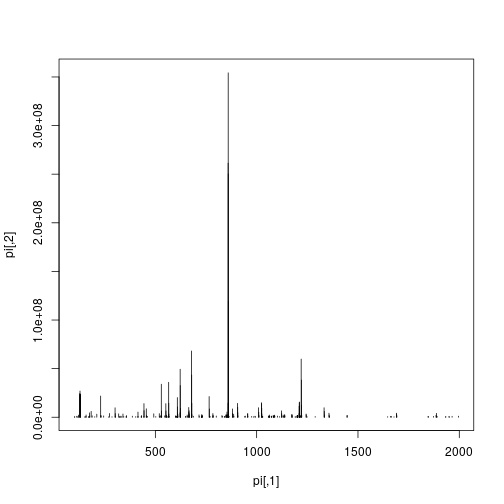

```r
mz <- hd2[i, "basePeakMZ"]
plot(pi, type = "h", xlim = c(mz-0.5, mz+0.5))
```

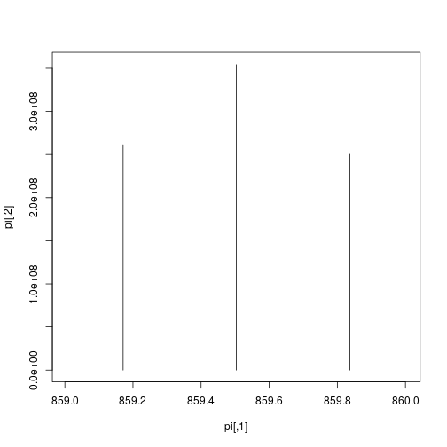


```r
## Zooming into spectrum 300 (an MS1 spectrum).
j <- 300
pj <- peaks(ms, j)
plot(pj, type = "l")
```

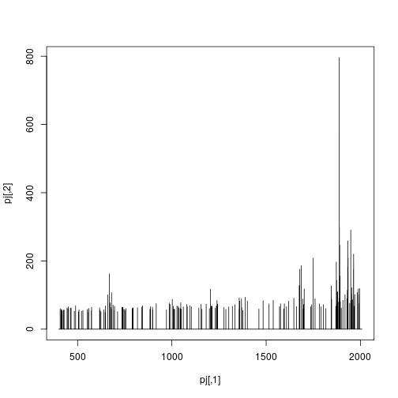

```r
plot(pj, type = "l", xlim = c(480, 485))
```

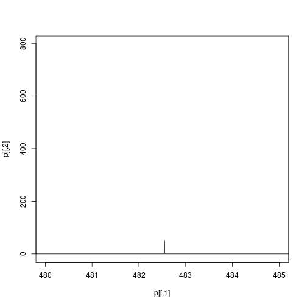
</details>

### Exercise

Using the first raw data file starting with `MS3TMT10`, answer the
following questions:

* What type of data is returned by the `openMSfile` function?
* How many spectra are there in that file?
* How many MS levels, and how many spectra per MS level?
* What is the index of the MS2 spectrum with the highest precursor
  intensity?
* Plot one spectrum of each level.

## High level abstraction

While having full access to the raw data gives full control, at times
it requires a lot of effort to achieve mundane things and can be very
repetitive. There is a need for abstraction, i.e. that we shouldn't
need to know about all the details that are exposed by `mzR` to access
and manipulate raw data. In comes `MSnbase` and the `MSnExp` data
structure, that provides a much smoother approach to *handle* and
*annotate* raw data (we will see this in more details tomorrow).


An `MSnExp` contains the data and annotation to describe an MS
experiment. The data is composed of all the MS spectra (the output of
`mzR::peaks` above) and the annotation is stored in a
`data.frame`-like structure called the *feature metadata* slot
(*fData* for short). This feature metadata contains by default (or can
contain, to be precise) the content the `mzR::header` seen above, but
can be extended as need (adding identification data, for example - to
be discussed tomorrow).


```r
library("MSnbase")
```

Using the `readMSdata` function, passing one or more raw data file
names as input, we create an `MSnExp` object.


```r
rw1 <- readMSData(f2, mode = "inMemory", verbose = FALSE)
rw1
```

```
## MSn experiment data ("MSnExp")
## Object size in memory: 41.95 Mb
## - - - Spectra data - - -
##  MS level(s): 2 
##  Number of spectra: 6103 
##  MSn retention times: 3:22 - 60:2 minutes
## - - - Processing information - - -
## Data loaded: Sat Feb 15 22:20:17 2020 
##  MSnbase version: 2.12.0 
## - - - Meta data  - - -
## phenoData
##   rowNames:
##     TMT_Erwinia_1uLSike_Top10HCD_isol2_45stepped_60min_01-20141210.mzML.gz
##   varLabels: sampleNames
##   varMetadata: labelDescription
## Loaded from:
##   TMT_Erwinia_1uLSike_Top10HCD_isol2_45stepped_60min_01-20141210.mzML.gz 
## protocolData: none
## featureData
##   featureNames: F1.S0001 F1.S0002 ... F1.S6103 (6103 total)
##   fvarLabels: spectrum
##   fvarMetadata: labelDescription
## experimentData: use 'experimentData(object)'
```


```r
rw2 <- readMSData(f2, mode = "onDisk", verbose = FALSE)
rw2
```

```
## MSn experiment data ("OnDiskMSnExp")
## Object size in memory: 3.31 Mb
## - - - Spectra data - - -
##  MS level(s): 1 2 
##  Number of spectra: 7534 
##  MSn retention times: 0:0 - 60:2 minutes
## - - - Processing information - - -
## Data loaded [Sat Feb 15 22:20:40 2020] 
##  MSnbase version: 2.12.0 
## - - - Meta data  - - -
## phenoData
##   rowNames:
##     TMT_Erwinia_1uLSike_Top10HCD_isol2_45stepped_60min_01-20141210.mzML.gz
##   varLabels: sampleNames
##   varMetadata: labelDescription
## Loaded from:
##   TMT_Erwinia_1uLSike_Top10HCD_isol2_45stepped_60min_01-20141210.mzML.gz 
## protocolData: none
## featureData
##   featureNames: F1.S0001 F1.S0002 ... F1.S7534 (7534 total)
##   fvarLabels: fileIdx spIdx ... spectrum (35 total)
##   fvarMetadata: labelDescription
## experimentData: use 'experimentData(object)'
```

### Exercise

What differences can you spot between the `rw1` and `rw2` objects?


From the outside, the two functions above are very similar. The major
difference is that the former reads the data from only one type of MS
level into memory. The second function, does not read any raw data
into memory (and hence is much faster) and supports any number of MS
levels. The raw data is accessed on demand when needed. If you are
interested in a benchmark between the two approaches, look at the
[*benchmarking*
vignette](http://bioconductor.org/packages/devel/bioc/vignettes/MSnbase/inst/doc/benchmarking.html),
available by typing `vignette("benchmarking", package = "MSnbase")`.

Let's extract spectra 4192 and 300, or 1 to 5, as we did above. We
can do this using the familiar `[[` and `[` operators:


```r
## i and j were defined above
rw1[[i]]
```

```
## Object of class "Spectrum2"
##  Precursor: 859.1722 
##  Retention time: 45:51 
##  Charge: 3 
##  MSn level: 2 
##  Peaks count: 275 
##  Total ion count: 2269568558
```

```r
rw2[[i]]
```

```
## Object of class "Spectrum2"
##  Precursor: 472.3352 
##  Retention time: 38:26 
##  Charge: 2 
##  MSn level: 2 
##  Peaks count: 132 
##  Total ion count: 12185289
```

```r
rw1[[j]]
```

```
## Object of class "Spectrum2"
##  Precursor: 602.8553 
##  Retention time: 19:23 
##  Charge: 2 
##  MSn level: 2 
##  Peaks count: 187 
##  Total ion count: 2358111
```

```r
rw2[[j]]
```

```
## Object of class "Spectrum1"
##  Retention time: 4:45 
##  MSn level: 1 
##  Total ion count: 2661 
##  Polarity: 1
```


```r
rw1[1:5]
```

```
## MSn experiment data ("MSnExp")
## Object size in memory: 0.03 Mb
## - - - Spectra data - - -
##  MS level(s): 2 
##  Number of spectra: 5 
##  MSn retention times: 3:22 - 3:24 minutes
## - - - Processing information - - -
## Data loaded: Sat Feb 15 22:20:17 2020 
## Data [numerically] subsetted 5 spectra: Sat Feb 15 22:20:45 2020 
##  MSnbase version: 2.12.0 
## - - - Meta data  - - -
## phenoData
##   rowNames:
##     TMT_Erwinia_1uLSike_Top10HCD_isol2_45stepped_60min_01-20141210.mzML.gz
##   varLabels: sampleNames
##   varMetadata: labelDescription
## Loaded from:
##   TMT_Erwinia_1uLSike_Top10HCD_isol2_45stepped_60min_01-20141210.mzML.gz 
## protocolData: none
## featureData
##   featureNames: F1.S0001 F1.S0002 ... F1.S0005 (5 total)
##   fvarLabels: spectrum
##   fvarMetadata: labelDescription
## experimentData: use 'experimentData(object)'
```

```r
rw2[1:5]
```

```
## MSn experiment data ("OnDiskMSnExp")
## Object size in memory: 0.03 Mb
## - - - Spectra data - - -
##  MS level(s): 1 
##  Number of spectra: 5 
##  MSn retention times: 0:0 - 0:4 minutes
## - - - Processing information - - -
## Data loaded [Sat Feb 15 22:20:40 2020] 
##  MSnbase version: 2.12.0 
## - - - Meta data  - - -
## phenoData
##   rowNames:
##     TMT_Erwinia_1uLSike_Top10HCD_isol2_45stepped_60min_01-20141210.mzML.gz
##   varLabels: sampleNames
##   varMetadata: labelDescription
## Loaded from:
##   TMT_Erwinia_1uLSike_Top10HCD_isol2_45stepped_60min_01-20141210.mzML.gz 
## protocolData: none
## featureData
##   featureNames: F1.S0001 F1.S0002 ... F1.S0005 (5 total)
##   fvarLabels: fileIdx spIdx ... spectrum (35 total)
##   fvarMetadata: labelDescription
## experimentData: use 'experimentData(object)'
```

And plot them


```r
plot(rw1[[j]])
```

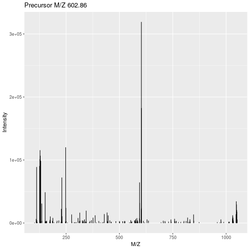


```r
plot(rw1[[i]], full = TRUE, reporters = TMT6, centroided = TRUE)
```

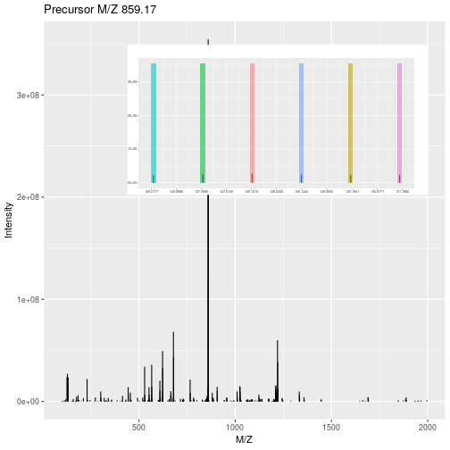

The feature metadata is stored as part of the `MSnExp` object and can
be accessed with the `fData` accessor function


```r
fData(rw2)
```

```
##          fileIdx spIdx smoothed seqNum acquisitionNum msLevel polarity
## F1.S0001       1     1       NA      1              1       1        1
## F1.S0002       1     2       NA      2              2       1        1
## F1.S0003       1     3       NA      3              3       1        1
## F1.S0004       1     4       NA      4              4       1        1
## F1.S0005       1     5       NA      5              5       1        1
## F1.S0006       1     6       NA      6              6       1        1
## F1.S0007       1     7       NA      7              7       1        1
## F1.S0008       1     8       NA      8              8       1        1
## F1.S0009       1     9       NA      9              9       1        1
## F1.S0010       1    10       NA     10             10       1        1
## F1.S0011       1    11       NA     11             11       1        1
## F1.S0012       1    12       NA     12             12       1        1
## F1.S0013       1    13       NA     13             13       1        1
## F1.S0014       1    14       NA     14             14       1        1
##          originalPeaksCount totIonCurrent retentionTime basePeakMZ
## F1.S0001              25800       9187505        0.4584     445.12
## F1.S0002              25934       9118685        0.9725     445.12
## F1.S0003              26148       9247653        1.8524     445.12
## F1.S0004              26330       9195261        2.7424     445.12
## F1.S0005              26463       9202081        3.6124     445.12
## F1.S0006              25580       9451720        4.4925     445.12
## F1.S0007              25191       9370178        5.3825     445.12
## F1.S0008              26957       9297793        6.2525     445.12
## F1.S0009              26608       9543710        7.1324     445.12
## F1.S0010              27062       9437697        8.0324     445.12
## F1.S0011              25763       9244707        8.8925     445.12
## F1.S0012              25577       9294566        9.7724     445.12
## F1.S0013              26282       9231183       10.6624     445.12
## F1.S0014              24474       9163494       11.5324     445.12
##          basePeakIntensity collisionEnergy ionisationEnergy    lowMZ   highMZ
## F1.S0001          984171.2              NA                0 399.9987 2008.454
## F1.S0002          989260.4              NA                0 399.9985 2008.453
## F1.S0003          997621.7              NA                0 399.9983 2008.453
## F1.S0004          988598.2              NA                0 399.9981 2008.451
## F1.S0005          971233.9              NA                0 399.9983 2008.452
## F1.S0006         1000968.4              NA                0 399.9981 2008.451
## F1.S0007         1004060.4              NA                0 399.9980 2008.451
## F1.S0008          985961.2              NA                0 399.9980 2008.451
## F1.S0009         1012269.5              NA                0 399.9980 2008.451
## F1.S0010          983832.0              NA                0 399.9980 2008.451
## F1.S0011          976695.8              NA                0 399.9978 2008.450
## F1.S0012          994047.6              NA                0 399.9979 2008.450
## F1.S0013          971733.5              NA                0 399.9978 2008.450
## F1.S0014          987855.7              NA                0 399.9977 2008.449
##          precursorScanNum precursorMZ precursorCharge precursorIntensity
## F1.S0001               NA          NA              NA                 NA
## F1.S0002               NA          NA              NA                 NA
## F1.S0003               NA          NA              NA                 NA
## F1.S0004               NA          NA              NA                 NA
## F1.S0005               NA          NA              NA                 NA
## F1.S0006               NA          NA              NA                 NA
## F1.S0007               NA          NA              NA                 NA
## F1.S0008               NA          NA              NA                 NA
## F1.S0009               NA          NA              NA                 NA
## F1.S0010               NA          NA              NA                 NA
## F1.S0011               NA          NA              NA                 NA
## F1.S0012               NA          NA              NA                 NA
## F1.S0013               NA          NA              NA                 NA
## F1.S0014               NA          NA              NA                 NA
##          mergedScan mergedResultScanNum mergedResultStartScanNum
## F1.S0001         NA                  NA                       NA
## F1.S0002         NA                  NA                       NA
## F1.S0003         NA                  NA                       NA
## F1.S0004         NA                  NA                       NA
## F1.S0005         NA                  NA                       NA
## F1.S0006         NA                  NA                       NA
## F1.S0007         NA                  NA                       NA
## F1.S0008         NA                  NA                       NA
## F1.S0009         NA                  NA                       NA
## F1.S0010         NA                  NA                       NA
## F1.S0011         NA                  NA                       NA
## F1.S0012         NA                  NA                       NA
## F1.S0013         NA                  NA                       NA
## F1.S0014         NA                  NA                       NA
##          mergedResultEndScanNum injectionTime
## F1.S0001                     NA      50.38262
## F1.S0002                     NA      51.13650
## F1.S0003                     NA      50.36058
## F1.S0004                     NA      51.23796
## F1.S0005                     NA      50.87993
## F1.S0006                     NA      50.30515
## F1.S0007                     NA      50.08440
## F1.S0008                     NA      49.81701
## F1.S0009                     NA      51.12255
## F1.S0010                     NA      50.92492
## F1.S0011                     NA      51.28786
## F1.S0012                     NA      48.79818
## F1.S0013                     NA      50.32028
## F1.S0014                     NA      50.93900
##                                   filterString
## F1.S0001 FTMS + p NSI Full ms [400.00-2000.00]
## F1.S0002 FTMS + p NSI Full ms [400.00-2000.00]
## F1.S0003 FTMS + p NSI Full ms [400.00-2000.00]
## F1.S0004 FTMS + p NSI Full ms [400.00-2000.00]
## F1.S0005 FTMS + p NSI Full ms [400.00-2000.00]
## F1.S0006 FTMS + p NSI Full ms [400.00-2000.00]
## F1.S0007 FTMS + p NSI Full ms [400.00-2000.00]
## F1.S0008 FTMS + p NSI Full ms [400.00-2000.00]
## F1.S0009 FTMS + p NSI Full ms [400.00-2000.00]
## F1.S0010 FTMS + p NSI Full ms [400.00-2000.00]
## F1.S0011 FTMS + p NSI Full ms [400.00-2000.00]
## F1.S0012 FTMS + p NSI Full ms [400.00-2000.00]
## F1.S0013 FTMS + p NSI Full ms [400.00-2000.00]
## F1.S0014 FTMS + p NSI Full ms [400.00-2000.00]
##                                           spectrumId centroided
## F1.S0001  controllerType=0 controllerNumber=1 scan=1      FALSE
## F1.S0002  controllerType=0 controllerNumber=1 scan=2      FALSE
## F1.S0003  controllerType=0 controllerNumber=1 scan=3      FALSE
## F1.S0004  controllerType=0 controllerNumber=1 scan=4      FALSE
## F1.S0005  controllerType=0 controllerNumber=1 scan=5      FALSE
## F1.S0006  controllerType=0 controllerNumber=1 scan=6      FALSE
## F1.S0007  controllerType=0 controllerNumber=1 scan=7      FALSE
## F1.S0008  controllerType=0 controllerNumber=1 scan=8      FALSE
## F1.S0009  controllerType=0 controllerNumber=1 scan=9      FALSE
## F1.S0010 controllerType=0 controllerNumber=1 scan=10      FALSE
## F1.S0011 controllerType=0 controllerNumber=1 scan=11      FALSE
## F1.S0012 controllerType=0 controllerNumber=1 scan=12      FALSE
## F1.S0013 controllerType=0 controllerNumber=1 scan=13      FALSE
## F1.S0014 controllerType=0 controllerNumber=1 scan=14      FALSE
##          ionMobilityDriftTime isolationWindowTargetMZ
## F1.S0001                   NA                      NA
## F1.S0002                   NA                      NA
## F1.S0003                   NA                      NA
## F1.S0004                   NA                      NA
## F1.S0005                   NA                      NA
## F1.S0006                   NA                      NA
## F1.S0007                   NA                      NA
## F1.S0008                   NA                      NA
## F1.S0009                   NA                      NA
## F1.S0010                   NA                      NA
## F1.S0011                   NA                      NA
## F1.S0012                   NA                      NA
## F1.S0013                   NA                      NA
## F1.S0014                   NA                      NA
##          isolationWindowLowerOffset isolationWindowUpperOffset
## F1.S0001                         NA                         NA
## F1.S0002                         NA                         NA
## F1.S0003                         NA                         NA
## F1.S0004                         NA                         NA
## F1.S0005                         NA                         NA
## F1.S0006                         NA                         NA
## F1.S0007                         NA                         NA
## F1.S0008                         NA                         NA
## F1.S0009                         NA                         NA
## F1.S0010                         NA                         NA
## F1.S0011                         NA                         NA
## F1.S0012                         NA                         NA
## F1.S0013                         NA                         NA
## F1.S0014                         NA                         NA
##          scanWindowLowerLimit scanWindowUpperLimit spectrum
## F1.S0001                  400                 2000        1
## F1.S0002                  400                 2000        2
## F1.S0003                  400                 2000        3
## F1.S0004                  400                 2000        4
## F1.S0005                  400                 2000        5
## F1.S0006                  400                 2000        6
## F1.S0007                  400                 2000        7
## F1.S0008                  400                 2000        8
## F1.S0009                  400                 2000        9
## F1.S0010                  400                 2000       10
## F1.S0011                  400                 2000       11
## F1.S0012                  400                 2000       12
## F1.S0013                  400                 2000       13
## F1.S0014                  400                 2000       14
##  [ reached 'max' / getOption("max.print") -- omitted 7520 rows ]
```

Below, we will continue to work with the *in memory* raw data object.

### More data handling

Is the data centroided or in profile mode?


```r
head(centroided(rw2))
```

```
## F1.S0001 F1.S0002 F1.S0003 F1.S0004 F1.S0005 F1.S0006 
##    FALSE    FALSE    FALSE    FALSE    FALSE    FALSE
```

```r
table(centroided(rw2))
```

```
## 
## FALSE  TRUE 
##  1431  6103
```

```r
table(centroided(rw2), msLevel(rw2))
```

```
##        
##            1    2
##   FALSE 1431    0
##   TRUE     0 6103
```

It is also possible to set this when readin the data or manually


```r
tmp <- readMSData(f2, mode = "onDisk", centroided = c(FALSE, TRUE), verbose = FALSE)
table(centroided(tmp), msLevel(tmp))
```

```
##        
##            1    2
##   FALSE 1431    0
##   TRUE     0 6103
```


```r
tmp <- readMSData(f2, mode = "onDisk", verbose = FALSE)
centroided(tmp, msLevel = 1) <- FALSE
centroided(tmp, msLevel = 2) <- TRUE
table(centroided(tmp), msLevel(tmp))
```

```
##        
##            1    2
##   FALSE 1431    0
##   TRUE     0 6103
```

### Peak lists

Similarly as for raw data, peak lists can be read into R as `MSnExp`
data using the `readMgfData`. See `?readMgfData` for details.

### Exercise

Using the file starting with `MS3TMT10`:

* Create an `MSnExp` object
* What MS levels do you have, and how many spectra of each
* What is the mode of the different MS levels

## Visualisation of raw MS data


The importance of flexible access to specialised data becomes visible
in the figure below (taken from the `RforProteomics`
[visualisation vignette](http://bioconductor.org/packages/release/data/experiment/vignettes/RforProteomics/inst/doc/RProtVis.html)).
**Not only can we access specific data and understand/visualise them,
but we can transverse all the data and extracted/visualise/understand
structured slices of data.**


In this code chunks we start by selecting relevant spectra of
interest. We will focus on the first MS1 spectrum acquired after 30
minutes of retention time.


```r
## (3) MS1 spectra indices
ms1 <- which(msLevel(rw2) == 1)
## (4) Select MS1 spectra with retention time between 30 and 35 minutes
rtsel <- rtime(rw2)[ms1] / 60 > 30 &
                  rtime(rw2)[ms1] / 60 < 35
## (5) Indices of the 1st and 2nd MS1 spectra after 30 minutes
i <- ms1[which(rtsel)][1]
j <- ms1[which(rtsel)][2]
## (6) Interleaved MS2 spectra
ms2 <- (i+1):(j-1)
```

Now now extract and plot all relevant information:

* The upper panel represents the chromatogram of the TMT_Erwinia_1uLSike_Top10HCD_isol2_45stepped_60min_01-20141210.mzML.gz
  raw data file, produced with `chromatogram`.


```r
chr <- chromatogram(rw2)
chr
```

```
## Chromatograms with 1 row and 1 column
##      TMT_Erwinia_1uLSike_Top10HCD_isol2_45stepped_60min_01-20141210.mzML.gz
##                                                              <Chromatogram>
## [1,]                                                           length: 1431
## phenoData with 1 variables
## featureData with 1 variables
```

```r
plot(chr)
```

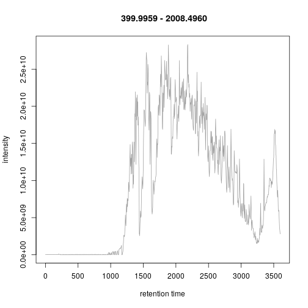

* We concentrate at a specific retention time, 
  30:1 minutes (1800.6836 seconds) 


```r
plot(chr)
abline(v = fData(rw2)[i, "retentionTime"], col = "red")
```

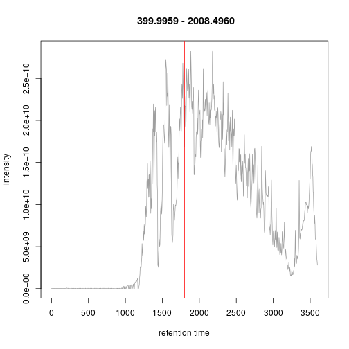

* This corresponds to the 2807 th MS1 spectrum, shown on the second row of figures.


```r
p <- plot(rw2[[i]]) 
```

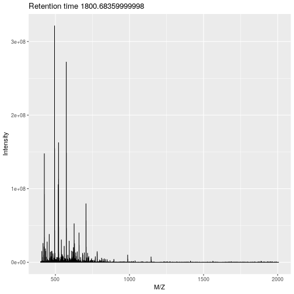

```r
p + ggplot2::xlim(400, 1000)
```

```
## Warning: Removed 3812 rows containing missing values (geom_path).
```

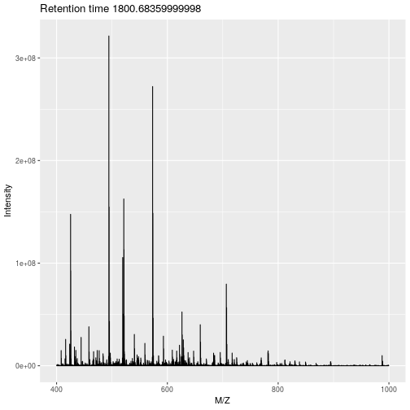
 
or using base plotting:
 

```r
pi <- as(rw2[[i]], "data.frame")
plot(pi, type = "l", xlim = c(400, 1000))
legend("topright", bty = "n",
       legend = paste0(
           "Acquisition ", acquisitionNum(rw2)[i],  "\n",
           "Retention time ", formatRt(rtime(rw2)[i])))
```

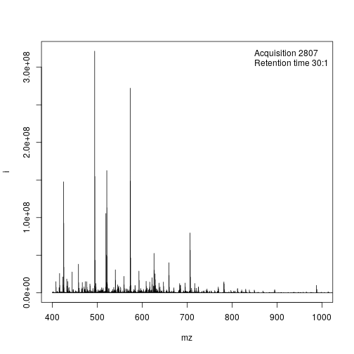

* The ions that were selected for MS2 are highlighted by vertical
  lines. These are represented in the bottom part of the figure.


```r
plot(pi, type = "l", xlim = c(400, 1000))
legend("topright", bty = "n",
       legend = paste0(
           "Acquisition ", acquisitionNum(rw2)[i],  "\n",
           "Retention time ", formatRt(rtime(rw2)[i])))
abline(v = precursorMz(rw2)[ms2],
       col = c("#FF000080",
           rep("#12121280", 9)))
```

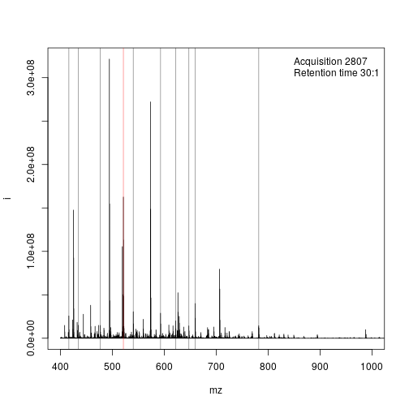

* On the right, we zoom on the isotopic envelope of one peptide in
  particular (the one highlighted with a red line).


```r
plot(pi, type = "l", xlim = c(521, 522.5))
abline(v = precursorMz(rw2)[ms2], col = "#FF000080")
```

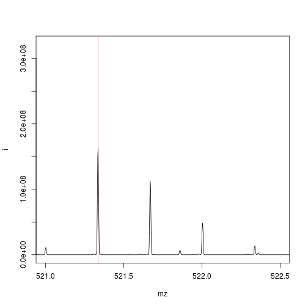

* A final loop through the relevant MS2 spectra plots the
  `length(ms2)` MS2 spectra highlighted above.


```r
par(mfrow = c(5, 2), mar = c(2, 2, 0, 1))
for (ii in ms2) {
    pj <- as(rw2[[ii]], "data.frame")
    plot(pj, xlab = "", ylab = "", type = "h", cex.axis = .6)
    legend("topright", legend = paste0("Prec M/Z\n",
                           round(precursorMz(rw2)[ii], 2)),
           bty = "n", cex = .8)
}
```

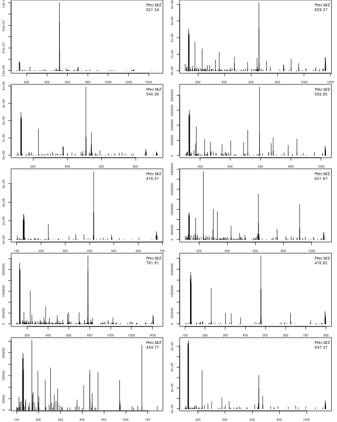

## Relations between spectra

The `filterPrecursorScan` makes the above much easier by extracting
*related* spectra:


```r
i <- which(rtime(rw2)/60 > 30 & msLevel(rw2) == 1)[1]
acquisitionNum(rw2)[i]
```

```
## F1.S2807 
##     2807
```

```r
rw3 <- filterPrecursorScan(rw2, 2807)
rw3
```

```
## MSn experiment data ("OnDiskMSnExp")
## Object size in memory: 0.04 Mb
## - - - Spectra data - - -
##  MS level(s): 1 2 
##  Number of spectra: 11 
##  MSn retention times: 30:1 - 30:4 minutes
## - - - Processing information - - -
## Data loaded [Sat Feb 15 22:20:40 2020] 
## Filter: select parent/children scans for 2807 [Sat Feb 15 22:22:17 2020] 
##  MSnbase version: 2.12.0 
## - - - Meta data  - - -
## phenoData
##   rowNames:
##     TMT_Erwinia_1uLSike_Top10HCD_isol2_45stepped_60min_01-20141210.mzML.gz
##   varLabels: sampleNames
##   varMetadata: labelDescription
## Loaded from:
##   TMT_Erwinia_1uLSike_Top10HCD_isol2_45stepped_60min_01-20141210.mzML.gz 
## protocolData: none
## featureData
##   featureNames: F1.S2807 F1.S2808 ... F1.S2817 (11 total)
##   fvarLabels: fileIdx spIdx ... spectrum (35 total)
##   fvarMetadata: labelDescription
## experimentData: use 'experimentData(object)'
```

## MS map

Below, we illustrate some additional visualisation and animations of
raw MS data, also taken from the `RforProteomics`
[visualisation vignette](http://bioconductor.org/packages/release/data/experiment/vignettes/RforProteomics/inst/doc/RProtVis.html). On
the left, we have a heatmap visualisation of a MS map and a 3
dimensional representation of the same data. On the right, 2 MS1
spectra in blue and the set of interleaves 10 MS2 spectra.


```r
## Additional packages
library("lattice")
library("gridExtra")

M3 <- MSmap(rw2, ms1[rtsel], 521, 523, .005)
plot(M3, aspect = 1, allTicks = FALSE)
```

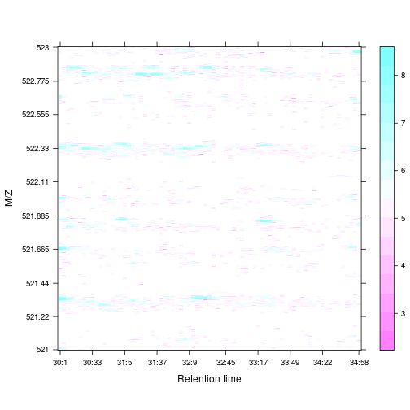

```r
plot3D(M3)
```

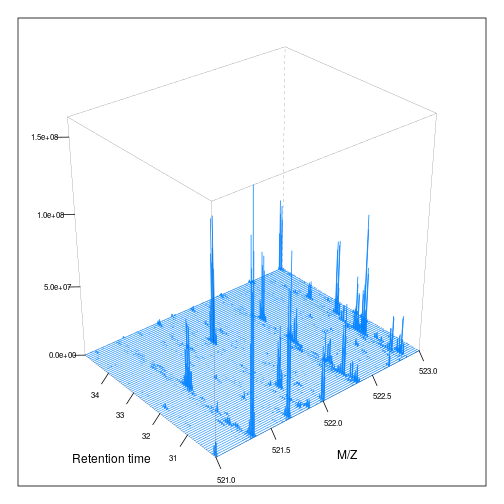

```r
if (require("rgl") & interactive())
    plot3D(M3, rgl = TRUE)
```


```r
i <- ms1[which(rtsel)][1]
j <- ms1[which(rtsel)][2]
M4 <- MSmap(rw2, i:j, 100, 1000, 1)
plot3D(M4)    
```

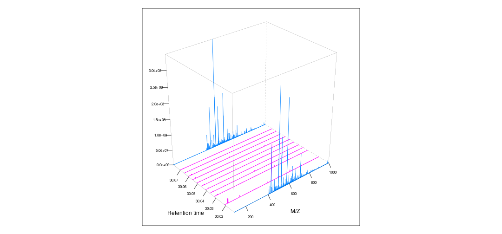

Below, we have animations build from extracting successive slices as above.


# Raw data processing

`MSnbase` also provides some raw data processing functionality, that
can be used for some targeted data exploration; for example, mz
trimming, intensity thresholding, peak picking, smoothing, ... We
redirect you to section 6 *Raw data processing* of the [main `MSnbase`
vignette](http://lgatto.github.io/MSnbase/articles/v01-MSnbase-demo.html)
(available with `vignette("MSnbase-demo", package =
"MSnbase")`). 


