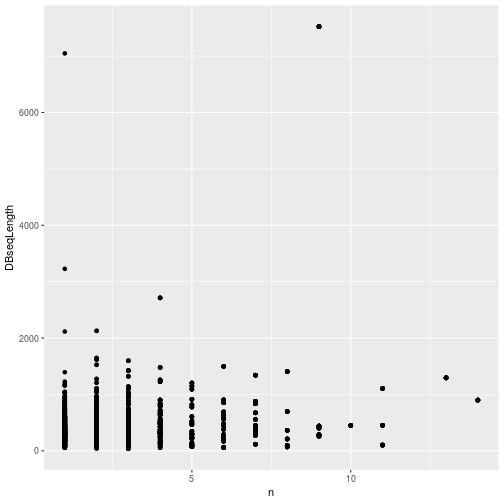
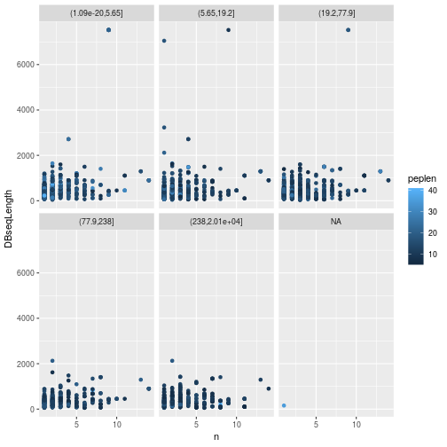
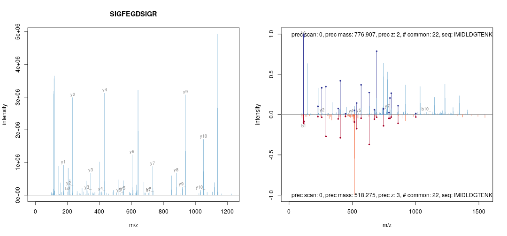

# Identification data


## Identification data.frame

Let's use the identification from from `msdata`:


```r
idf <- msdata::ident(full.names = TRUE)
basename(idf)
```

```
## [1] "TMT_Erwinia_1uLSike_Top10HCD_isol2_45stepped_60min_01-20141210.mzid"
```

The easiest way to read identification data in `mzIdentML` (often
abbreviated with `mzid`) into R is to read it with `readMzIdData`,
that will parse it, process it, and return a `data.frame`:


```r
iddf <- readMzIdData(idf)
head(iddf)
```

```
##                    sequence                                    spectrumID
## 1              RQCRTDFLNYLR controllerType=0 controllerNumber=1 scan=2949
## 2    ESVALADQVTCVDWRNRKATKK controllerType=0 controllerNumber=1 scan=6534
## 3              KELLCLAMQIIR controllerType=0 controllerNumber=1 scan=5674
## 4    QRMARTSDKQQSIRFLERLCGR controllerType=0 controllerNumber=1 scan=4782
## 5  KDEGSTEPLKVVRDMTDAICMLLR controllerType=0 controllerNumber=1 scan=5839
## 6 DGGPAIYGHERVGRNAKKFKCLKFR controllerType=0 controllerNumber=1 scan=6118
##   chargeState rank passThreshold experimentalMassToCharge
## 1           3    1          TRUE                 548.2856
## 2           2    1          TRUE                1288.1528
## 3           2    1          TRUE                 744.4109
## 4           3    1          TRUE                 913.1642
## 5           3    1          TRUE                 926.8102
## 6           3    1          TRUE                 969.1943
##   calculatedMassToCharge modNum isDecoy post pre start end DatabaseAccess
## 1               547.9474      1   FALSE    V   R   574 585        ECA2006
## 2              1288.1741      1   FALSE    G   R    69  90        ECA1676
## 3               744.4255      1    TRUE    Q   R   131 142    XXX_ECA2855
## 4               912.8134      1   FALSE    D   R   182 203        ECA3009
## 5               926.4713      1    TRUE    R   R   135 158    XXX_ECA0048
## 6               968.8557      1   FALSE    S   K   310 334        ECA1420
##   DBseqLength DatabaseSeq
## 1        1295            
## 2         110            
## 3         157            
## 4         437            
## 5         501            
## 6         477            
##                                          DatabaseDescription scan.number.s.
## 1                             ECA2006 ATP-dependent helicase           2949
## 2                 ECA1676 putative growth inhibitory protein           6534
## 3                                                                      5674
## 4                ECA3009 putative coproporphyrinogen oxidase           4782
## 5                                                                      5839
## 6 ECA1420 undecaprenyl-phosphate galactosephosphotransferase           6118
##   acquisitionNum
## 1           2949
## 2           6534
## 3           5674
## 4           4782
## 5           5839
## 6           6118
##                                                          spectrumFile
## 1 TMT_Erwinia_1uLSike_Top10HCD_isol2_45stepped_60min_01-20141210.mzML
## 2 TMT_Erwinia_1uLSike_Top10HCD_isol2_45stepped_60min_01-20141210.mzML
## 3 TMT_Erwinia_1uLSike_Top10HCD_isol2_45stepped_60min_01-20141210.mzML
## 4 TMT_Erwinia_1uLSike_Top10HCD_isol2_45stepped_60min_01-20141210.mzML
## 5 TMT_Erwinia_1uLSike_Top10HCD_isol2_45stepped_60min_01-20141210.mzML
## 6 TMT_Erwinia_1uLSike_Top10HCD_isol2_45stepped_60min_01-20141210.mzML
##                                                                idFile
## 1 TMT_Erwinia_1uLSike_Top10HCD_isol2_45stepped_60min_01-20141210.mzid
## 2 TMT_Erwinia_1uLSike_Top10HCD_isol2_45stepped_60min_01-20141210.mzid
## 3 TMT_Erwinia_1uLSike_Top10HCD_isol2_45stepped_60min_01-20141210.mzid
## 4 TMT_Erwinia_1uLSike_Top10HCD_isol2_45stepped_60min_01-20141210.mzid
## 5 TMT_Erwinia_1uLSike_Top10HCD_isol2_45stepped_60min_01-20141210.mzid
## 6 TMT_Erwinia_1uLSike_Top10HCD_isol2_45stepped_60min_01-20141210.mzid
##   MS.GF.RawScore MS.GF.DeNovoScore MS.GF.SpecEValue MS.GF.EValue MS.GF.QValue
## 1             10               101     4.617121e-08    0.1321981    0.5254237
## 2             12               121     7.255875e-08    0.2087481    0.6103896
## 3              8                74     9.341019e-08    0.2674533    0.6250000
## 4             -5               160     1.270731e-07    0.3655833    0.7169811
## 5              8               241     1.318240e-07    0.3794606    0.7363637
## 6              7               214     1.722033e-07    0.4958171    0.8370370
##   MS.GF.PepQValue         modName  modMass modLocation subOriginalResidue
## 1       0.5490196 Carbamidomethyl 57.02146           3               <NA>
## 2       0.6231884 Carbamidomethyl 57.02146          11               <NA>
## 3       0.6363636 Carbamidomethyl 57.02146           5               <NA>
## 4       0.7244898 Carbamidomethyl 57.02146          20               <NA>
## 5       0.7450980 Carbamidomethyl 57.02146          20               <NA>
## 6       0.8560000 Carbamidomethyl 57.02146          21               <NA>
##   subReplacementResidue subLocation
## 1                  <NA>          NA
## 2                  <NA>          NA
## 3                  <NA>          NA
## 4                  <NA>          NA
## 5                  <NA>          NA
## 6                  <NA>          NA
```

When adding identification data with the `addIdentificationData`
function as shown above, the data is first read with `readMzIdData`,
and is then cleaned up:

- only PSMs matching the regular (non-decoy) database are retained;
- PSMs or rank greater than 1 are discarded;
- only proteotypic peptides are kept, i.e. those that match to a
  unique peptide.


```r
## at this stage, we still have all the PSMs
table(iddf$isDecoy)
```

```
## 
## FALSE  TRUE 
##  2906  2896
```

```r
table(iddf$rank)
```

```
## 
##    1    2    3    4 
## 5487  302   12    1
```

> **Exercise** This behaviour can be replicates with the
> `filterIdentificationDataFrame` function. Try it out for yourself.

<details>

```r
iddf2 <- filterIdentificationDataFrame(iddf)
table(iddf2$isDecoy)
```

```
## 
## FALSE 
##  2710
```

```r
table(iddf2$rank)
```

```
## 
##    1 
## 2710
```
</details>

> **Exercise** The standard *[tidyverse](https://CRAN.R-project.org/package=tidyverse)* tools are fit for
> data wrangling with identification data. Using the above
> identification dataframe, calculate the length of each peptide (you
> can use `nchar` with the peptide sequence `sequence`) and the number
> of peptides for each protein (defined as
> `DatabaseDescription`). Plot the length of the proteins against
> their respective number of peptides. Optionally, stratify the plot
> by the peptide e-value score (`MS.GF.EValue`) using for example
> `cut` to define bins.

<details>

```r
suppressPackageStartupMessages(library("dplyr"))
iddf2 <- as_tibble(iddf2) %>%
    mutate(peplen = nchar(sequence))
npeps <- iddf2 %>%
    group_by(DatabaseDescription) %>%
    tally
iddf2 <- full_join(iddf2, npeps)
```

```
## Joining, by = "DatabaseDescription"
```

```r
library("ggplot2")
ggplot(iddf2, aes(x = n, y = DBseqLength)) + geom_point()
```




```r
iddf2$evalBins <- cut(iddf2$MS.GF.EValue, summary(iddf2$MS.GF.EValue))
ggplot(iddf2, aes(x = n, y = DBseqLength, color = peplen)) +
    geom_point() +
    facet_wrap(~ evalBins)
```


</details>


## Low level access to id data

There are two packages that can be used to parse `mzIdentML` files,
namely `mzR` (that we have already used for raw data) and `mzID`. The
major difference is that the former leverages C++ code from
`proteowizard` and is hence faster than the latter (which uses the
`XML` R package). They both work in similar ways.


```
## Warning: replacing previous import 'MSnbase::plot' by 'graphics::plot' when
## loading 'RforProteomics'
```


|   |Data type      |File format |Data structure |Package |
|:--|:--------------|:-----------|:--------------|:-------|
|4  |Identification |mzIdentML   |mzRident       |mzR     |
|5  |Identification |mzIdentML   |mzID           |mzID    |

We are going to use the following identification file in this practical:


```r
library("msdata")
```

```
## 
## Attaching package: 'msdata'
```

```
## The following object is masked from 'package:dplyr':
## 
##     ident
```

```r
idf <- ident(full.names = TRUE)
basename(idf)
```

```
## [1] "TMT_Erwinia_1uLSike_Top10HCD_isol2_45stepped_60min_01-20141210.mzid"
```

### `mzID`

The main functions are `mzID` to read the data into a dedicated data
class and `flatten` to transform it into a `data.frame`. 


```r
library("mzID")
```

```
## 
## Attaching package: 'mzID'
```

```
## The following object is masked from 'package:dplyr':
## 
##     id
```

```r
id <- mzID(idf)
```

```
## reading TMT_Erwinia_1uLSike_Top10HCD_isol2_45stepped_60min_01-20141210.mzid... DONE!
```

```r
id
```

```
## An mzID object
## 
## Software used:   MS-GF+ (version: Beta (v10072))
## 
## Rawfile:         /home/lg390/dev/01_svn/workflows/proteomics/TMT_Erwinia_1uLSike_Top10HCD_isol2_45stepped_60min_01-20141210.mzML
## 
## Database:        /home/lg390/dev/01_svn/workflows/proteomics/erwinia_carotovora.fasta
## 
## Number of scans: 5343
## Number of PSM's: 5656
```

Various data can be extracted from the `mzID` object, using one the
accessor functions such as `database`, `software`, `scans`, `peptides`,
... The object can also be converted into a `data.frame` using the
`flatten` function.


```r
head(flatten(id))
```

```
##                                      spectrumid scan number(s) acquisitionnum
## 1 controllerType=0 controllerNumber=1 scan=5782           5782           5782
## 2 controllerType=0 controllerNumber=1 scan=6037           6037           6037
## 3 controllerType=0 controllerNumber=1 scan=5235           5235           5235
## 4 controllerType=0 controllerNumber=1 scan=5397           5397           5397
## 5 controllerType=0 controllerNumber=1 scan=6075           6075           6075
## 6 controllerType=0 controllerNumber=1 scan=5761           5761           5761
##   passthreshold rank calculatedmasstocharge experimentalmasstocharge
## 1          TRUE    1              1080.2321                1080.2325
## 2          TRUE    1              1002.2115                1002.2089
## 3          TRUE    1              1189.2800                1189.2836
## 4          TRUE    1               960.5365                 960.5365
## 5          TRUE    1              1264.3419                1264.3409
## 6          TRUE    1              1268.6501                1268.6429
##   chargestate ms-gf:denovoscore ms-gf:evalue ms-gf:pepqvalue ms-gf:qvalue
## 1           3               174 1.086033e-20               0            0
## 2           3               245 1.988774e-19               0            0
## 3           3               264 5.129649e-19               0            0
## 4           3               178 5.163566e-18               0            0
## 5           3               252 4.356914e-17               0            0
## 6           2               138 4.658952e-17               0            0
##   ms-gf:rawscore ms-gf:specevalue assumeddissociationmethod isotopeerror
## 1            147     3.764831e-27                       HCD            0
## 2            214     6.902626e-26                       HCD            0
## 3            211     1.778789e-25                       HCD            0
## 4            154     1.792541e-24                       HCD            0
## 5            188     1.510364e-23                       HCD            0
## 6            123     1.618941e-23                       HCD            0
##   isdecoy post pre end start accession length
## 1   FALSE    S   R  84    50   ECA1932    155
## 2   FALSE    R   K 315   288   ECA1147    434
## 3   FALSE    A   R 224   192   ECA0013    295
## 4   FALSE    -   R 290   264   ECA1731    290
## 5   FALSE    F   R 153   119   ECA1443    298
## 6   FALSE    Y   K 286   264   ECA1444    468
##                                         description
## 1                        outer membrane lipoprotein
## 2                                    trigger factor
## 3                ribose-binding periplasmic protein
## 4                                         flagellin
## 5      UTP--glucose-1-phosphate uridylyltransferase
## 6 6-phosphogluconate dehydrogenase, decarboxylating
##                                pepseq modified modification
## 1 PVQIQAGEDSNVIGALGGAVLGGFLGNTIGGGSGR    FALSE         <NA>
## 2        TQVLDGLINANDIEVPVALIDGEIDVLR    FALSE         <NA>
## 3   TKGLNVMQNLLTAHPDVQAVFAQNDEMALGALR    FALSE         <NA>
## 4         SQILQQAGTSVLSQANQVPQTVLSLLR    FALSE         <NA>
## 5 PIIGDNPFVVVLPDVVLDESTADQTQENLALLISR    FALSE         <NA>
## 6             WTSQSSLDLGEPLSLITESVFAR    FALSE         <NA>
##                                                                idFile
## 1 TMT_Erwinia_1uLSike_Top10HCD_isol2_45stepped_60min_01-20141210.mzid
## 2 TMT_Erwinia_1uLSike_Top10HCD_isol2_45stepped_60min_01-20141210.mzid
## 3 TMT_Erwinia_1uLSike_Top10HCD_isol2_45stepped_60min_01-20141210.mzid
## 4 TMT_Erwinia_1uLSike_Top10HCD_isol2_45stepped_60min_01-20141210.mzid
## 5 TMT_Erwinia_1uLSike_Top10HCD_isol2_45stepped_60min_01-20141210.mzid
## 6 TMT_Erwinia_1uLSike_Top10HCD_isol2_45stepped_60min_01-20141210.mzid
##                                                          spectrumFile
## 1 TMT_Erwinia_1uLSike_Top10HCD_isol2_45stepped_60min_01-20141210.mzML
## 2 TMT_Erwinia_1uLSike_Top10HCD_isol2_45stepped_60min_01-20141210.mzML
## 3 TMT_Erwinia_1uLSike_Top10HCD_isol2_45stepped_60min_01-20141210.mzML
## 4 TMT_Erwinia_1uLSike_Top10HCD_isol2_45stepped_60min_01-20141210.mzML
## 5 TMT_Erwinia_1uLSike_Top10HCD_isol2_45stepped_60min_01-20141210.mzML
## 6 TMT_Erwinia_1uLSike_Top10HCD_isol2_45stepped_60min_01-20141210.mzML
##               databaseFile
## 1 erwinia_carotovora.fasta
## 2 erwinia_carotovora.fasta
## 3 erwinia_carotovora.fasta
## 4 erwinia_carotovora.fasta
## 5 erwinia_carotovora.fasta
## 6 erwinia_carotovora.fasta
```

### `mzR`

The `mzR` interface provides a similar interface. It is however much
faster as it does not read all the data into memory and only extracts
relevant data on demand. It has also accessor functions such as
`softwareInfo`, `mzidInfo`, ... (use `showMethods(classes = "mzRident", where = "package:mzR")`)
to see all available methods.


```r
library("mzR")
id2 <- openIDfile(idf)
id2
```

```
## Identification file handle.
## Filename:  TMT_Erwinia_1uLSike_Top10HCD_isol2_45stepped_60min_01-20141210.mzid 
## Number of psms:  5759
```

```r
softwareInfo(id2)
```

```
## [1] "MS-GF+ Beta (v10072) "                      
## [2] "ProteoWizard MzIdentML 3.0.501 ProteoWizard"
```

The identification data can be accessed as a `data.frame` with the
`psms` accessor.


```r
head(psms(id2))
```

```
##                                      spectrumID chargeState rank passThreshold
## 1 controllerType=0 controllerNumber=1 scan=5782           3    1          TRUE
## 2 controllerType=0 controllerNumber=1 scan=6037           3    1          TRUE
## 3 controllerType=0 controllerNumber=1 scan=5235           3    1          TRUE
## 4 controllerType=0 controllerNumber=1 scan=5397           3    1          TRUE
## 5 controllerType=0 controllerNumber=1 scan=6075           3    1          TRUE
## 6 controllerType=0 controllerNumber=1 scan=5761           2    1          TRUE
##   experimentalMassToCharge calculatedMassToCharge
## 1                1080.2325              1080.2321
## 2                1002.2089              1002.2115
## 3                1189.2836              1189.2800
## 4                 960.5365               960.5365
## 5                1264.3409              1264.3419
## 6                1268.6429              1268.6501
##                              sequence modNum isDecoy post pre start end
## 1 PVQIQAGEDSNVIGALGGAVLGGFLGNTIGGGSGR      0   FALSE    S   R    50  84
## 2        TQVLDGLINANDIEVPVALIDGEIDVLR      0   FALSE    R   K   288 315
## 3   TKGLNVMQNLLTAHPDVQAVFAQNDEMALGALR      0   FALSE    A   R   192 224
## 4         SQILQQAGTSVLSQANQVPQTVLSLLR      0   FALSE    -   R   264 290
## 5 PIIGDNPFVVVLPDVVLDESTADQTQENLALLISR      0   FALSE    F   R   119 153
## 6             WTSQSSLDLGEPLSLITESVFAR      0   FALSE    Y   K   264 286
##   DatabaseAccess DBseqLength DatabaseSeq
## 1        ECA1932         155            
## 2        ECA1147         434            
## 3        ECA0013         295            
## 4        ECA1731         290            
## 5        ECA1443         298            
## 6        ECA1444         468            
##                                         DatabaseDescription scan.number.s.
## 1                        ECA1932 outer membrane lipoprotein           5782
## 2                                    ECA1147 trigger factor           6037
## 3                ECA0013 ribose-binding periplasmic protein           5235
## 4                                         ECA1731 flagellin           5397
## 5      ECA1443 UTP--glucose-1-phosphate uridylyltransferase           6075
## 6 ECA1444 6-phosphogluconate dehydrogenase, decarboxylating           5761
##   acquisitionNum
## 1           5782
## 2           6037
## 3           5235
## 4           5397
## 5           6075
## 6           5761
```

## Adding identification data to raw data

Here are two matching raw and identification data files:


```r
library("MSnbase")
## find path to a mzXML file
rwf <- dir(system.file(package = "MSnbase", dir = "extdata"),
           full.name = TRUE, pattern = "mzXML$")
## find path to a mzIdentML file
idf <- dir(system.file(package = "MSnbase", dir = "extdata"),
           full.name = TRUE, pattern = "dummyiTRAQ.mzid")
```

We first create the raw data object:


```r
msexp <- readMSData(rwf, verbose = FALSE)
head(fData(msexp))
```

```
##       spectrum
## F1.S1        1
## F1.S2        2
## F1.S3        3
## F1.S4        4
## F1.S5        5
```

The simply add identification data. The matching of spectra from the
raw data and the PSMs from the identification data is done internally.


```r
msexp <- addIdentificationData(msexp, idf)
head(fData(msexp))
```

```
##       spectrum acquisition.number          sequence chargeState rank
## F1.S1        1                  1 VESITARHGEVLQLRPK           3    1
## F1.S2        2                  2     IDGQWVTHQWLKK           3    1
## F1.S3        3                  3              <NA>          NA   NA
## F1.S4        4                  4              <NA>          NA   NA
## F1.S5        5                  5           LVILLFR           2    1
##       passThreshold experimentalMassToCharge calculatedMassToCharge modNum
## F1.S1          TRUE                 645.3741               645.0375      0
## F1.S2          TRUE                 546.9586               546.9633      0
## F1.S3            NA                       NA                     NA     NA
## F1.S4            NA                       NA                     NA     NA
## F1.S5          TRUE                 437.8040               437.2997      0
##       isDecoy post  pre start end DatabaseAccess DBseqLength DatabaseSeq
## F1.S1   FALSE    A    R   170 186        ECA0984         231            
## F1.S2   FALSE    A    K    50  62        ECA1028         275            
## F1.S3      NA <NA> <NA>    NA  NA           <NA>          NA        <NA>
## F1.S4      NA <NA> <NA>    NA  NA           <NA>          NA        <NA>
## F1.S5   FALSE    L    K    22  28        ECA0510         166            
##                                                              DatabaseDescription
## F1.S1                                        ECA0984 DNA mismatch repair protein
## F1.S2 ECA1028 2,3,4,5-tetrahydropyridine-2,6-dicarboxylate N-succinyltransferase
## F1.S3                                                                       <NA>
## F1.S4                                                                       <NA>
## F1.S5           ECA0510 putative capsular polysacharide biosynthesis transferase
##       scan.number.s.          idFile MS.GF.RawScore MS.GF.DeNovoScore
## F1.S1              1 dummyiTRAQ.mzid            -39                77
## F1.S2              2 dummyiTRAQ.mzid            -30                39
## F1.S3             NA            <NA>             NA                NA
## F1.S4             NA            <NA>             NA                NA
## F1.S5              5 dummyiTRAQ.mzid            -42                 5
##       MS.GF.SpecEValue MS.GF.EValue modName modMass modLocation
## F1.S1     5.527468e-05     79.36958    <NA>      NA          NA
## F1.S2     9.399048e-06     13.46615    <NA>      NA          NA
## F1.S3               NA           NA    <NA>      NA          NA
## F1.S4               NA           NA    <NA>      NA          NA
## F1.S5     2.577830e-04    366.38422    <NA>      NA          NA
##       subOriginalResidue subReplacementResidue subLocation nprot npep.prot
## F1.S1               <NA>                  <NA>          NA     1         1
## F1.S2               <NA>                  <NA>          NA     1         1
## F1.S3               <NA>                  <NA>          NA    NA        NA
## F1.S4               <NA>                  <NA>          NA    NA        NA
## F1.S5               <NA>                  <NA>          NA     1         1
##       npsm.prot npsm.pep
## F1.S1         1        1
## F1.S2         1        1
## F1.S3        NA       NA
## F1.S4        NA       NA
## F1.S5         1        1
```

## MS/MS database search

While searches are generally performed using third-party software
independently of R or can be started from R using a `system` call, the
*[MSGFplus](https://bioconductor.org/packages/3.10/MSGFplus)* package enables to perform a search using the
MSGF+ engine, as illustrated below.


We search the
`TMT_Erwinia_1uLSike_Top10HCD_isol2_45stepped_60min_01-20141210.mzML.gz`
file against the fasta file from `PXD000001` using `MSGFplus`.

We first download the fasta files from ProteomeXchange:


```r
fas <- pxget(px, "erwinia_carotovora.fasta")
```

```
## Error in pxget(px, "erwinia_carotovora.fasta"): could not find function "pxget"
```

```r
basename(fas)
```

```
## Error in basename(fas): object 'fas' not found
```

Below, we setup and run the
search^[In the `runMSGF` call, the memory allocated to the java virtual machine is limited to 1GB. In general, there is no need to specify this argument, unless you experience an error regarding the *maximum heap size*.].


```r
library("MSGFplus")
msgfpar <- msgfPar(database = fas,
                   instrument = 'HighRes',
                   tda = TRUE,
                   enzyme = 'Trypsin',
                   protocol = 'iTRAQ')
idres <- runMSGF(msgfpar, mzf, memory=1000)
idres
```

```
## An mzID object
## 
## Software used:   MS-GF+ (version: Beta (v10072))
## 
## Rawfile:         /home/lg390/Documents/Teaching/bioc-ms-prot/TMT_Erwinia_1uLSike_Top10HCD_isol2_45stepped_60min_01-20141210.mzML
## 
## Database:        /home/lg390/Documents/Teaching/bioc-ms-prot/erwinia_carotovora.fasta
## 
## Number of scans: 5343
## Number of PSM's: 5656
```

A graphical interface to perform the search the data and explore the
results is also available:


```r
library("MSGFgui")
MSGFgui()
```

* interface](./img/MSGFgui.png)

## Visualising identification data

For this part, let's use a ready made `MSnExp` object that is
distributed with the `MSnbase` package. Simply use the `data()`
function with the name of the desired data.


```r
library("MSnbase")
data(itraqdata)
```

### Annotated spectra and spectra comparison


```r
par(mfrow = c(1, 2))
itraqdata2 <- pickPeaks(itraqdata, verbose = FALSE)
s <- "SIGFEGDSIGR"
plot(itraqdata2[[14]], s, main = s)
plot(itraqdata2[[25]], itraqdata2[[28]], sequences = rep("IMIDLDGTENK", 2))
```



The annotation of spectra is obtained by simulating fragmentation of a
peptide and matching observed peaks to fragments:


```r
calculateFragments("SIGFEGDSIGR")
```

```
##            mz  ion type pos z        seq
## 1    88.03931   b1    b   1 1          S
## 2   201.12337   b2    b   2 1         SI
## 3   258.14483   b3    b   3 1        SIG
## 4   405.21324   b4    b   4 1       SIGF
## 5   534.25583   b5    b   5 1      SIGFE
## 6   591.27729   b6    b   6 1     SIGFEG
## 7   706.30423   b7    b   7 1    SIGFEGD
## 8   793.33626   b8    b   8 1   SIGFEGDS
## 9   906.42032   b9    b   9 1  SIGFEGDSI
## 10  963.44178  b10    b  10 1 SIGFEGDSIG
## 11  175.11895   y1    y   1 1          R
## 12  232.14041   y2    y   2 1         GR
## 13  345.22447   y3    y   3 1        IGR
## 14  432.25650   y4    y   4 1       SIGR
## 15  547.28344   y5    y   5 1      DSIGR
## 16  604.30490   y6    y   6 1     GDSIGR
## 17  733.34749   y7    y   7 1    EGDSIGR
## 18  880.41590   y8    y   8 1   FEGDSIGR
## 19  937.43736   y9    y   9 1  GFEGDSIGR
## 20 1050.52142  y10    y  10 1 IGFEGDSIGR
## 21  888.40975  b9_   b_   9 1  SIGFEGDSI
## 22  945.43121 b10_   b_  10 1 SIGFEGDSIG
## 23  529.27288  y5_   y_   5 1      DSIGR
## 24  586.29434  y6_   y_   6 1     GDSIGR
## 25  715.33693  y7_   y_   7 1    EGDSIGR
## 26  862.40534  y8_   y_   8 1   FEGDSIGR
## 27  919.42680  y9_   y_   9 1  GFEGDSIGR
## 28 1032.51086 y10_   y_  10 1 IGFEGDSIGR
## 29  157.10839  y1_   y_   1 1          R
## 30  214.12985  y2_   y_   2 1         GR
## 31  327.21391  y3_   y_   3 1        IGR
## 32  414.24594  y4_   y_   4 1       SIGR
```

Visualising a pair of spectra means that we can access them, and that,
in addition to plotting, we can manipulate them and perform
computations. The two spectra corresponding to the `IMIDLDGTENK`
peptide, for example have
22
common peaks, a correlation of
0.198
and a dot product of
0.21
(see `?compareSpectra` for details).

> **Exercise** Use the `compareSpectra` function to compare spectra 25
>  and 28 plotted above, calculating the metrics mentioned
>  above. Don't forget to pick peaks from `itraqdata` first.

<details>

```r
data(itraqdata)
itraqdata2 <- pickPeaks(itraqdata, verbose = FALSE)
compareSpectra(itraqdata2[[25]], itraqdata2[[28]], fun = "common")
```

```
## [1] 22
```

```r
compareSpectra(itraqdata2[[25]], itraqdata2[[28]], fun = "cor")
```

```
## [1] 0.1983378
```

```r
compareSpectra(itraqdata2[[25]], itraqdata2[[28]], fun = "dotproduct")
```

```
## [1] 0.2101533
```
</details>


## Exploration and Assessment of Confidence of LC-MSn Proteomics Identifications using `MSnID`

The `MSnID` package extracts MS/MS ID data from mzIdentML (leveraging
the `mzID` package) or text files. After collating the search results
from multiple datasets it assesses their identification quality and
optimises filtering criteria to achieve the maximum number of
identifications while not exceeding a specified false discovery
rate. It also contains a number of utilities to explore the MS/MS
results and assess missed and irregular enzymatic cleavages, mass
measurement accuracy, etc.

### Step-by-step work-flow

Let's reproduce parts of the analysis described the `MSnID`
vignette. You can explore more with 


```r
vignette("msnid_vignette", package = "MSnID")
```

The *[MSnID](https://bioconductor.org/packages/3.10/MSnID)* package can be used for post-search filtering
of MS/MS identifications. One starts with the construction of an
`MSnID` object that is populated with identification results that can
be imported from a `data.frame` or from `mzIdenML` files. Here, we
will use the example identification data provided with the package.


```r
mzids <- system.file("extdata", "c_elegans.mzid.gz", package="MSnID")
basename(mzids)
```

```
## [1] "c_elegans.mzid.gz"
```

We start by loading the package, initialising the `MSnID` object, and
add the identification result from our `mzid` file (there could of
course be more that one).


```r
library("MSnID")
msnid <- MSnID(".")
```

```
## Note, the anticipated/suggested columns in the
## peptide-to-spectrum matching results are:
## -----------------------------------------------
## accession
## calculatedMassToCharge
## chargeState
## experimentalMassToCharge
## isDecoy
## peptide
## spectrumFile
## spectrumID
```

```r
msnid <- read_mzIDs(msnid, mzids)
```

```
## Reading from mzIdentMLs ...
```

```
## reading c_elegans.mzid.gz... DONE!
```

```r
show(msnid)
```

```
## MSnID object
## Working directory: "."
## #Spectrum Files:  1 
## #PSMs: 12263 at 36 % FDR
## #peptides: 9489 at 44 % FDR
## #accessions: 7414 at 76 % FDR
```

Printing the `MSnID` object returns some basic information such as

* Working directory.
* Number of spectrum files used to generate data.
* Number of peptide-to-spectrum matches and corresponding FDR.
* Number of unique peptide sequences and corresponding FDR.
* Number of unique proteins or amino acid sequence accessions and corresponding FDR.


The package then enables to define, optimise and apply filtering based
for example on missed cleavages, identification scores, precursor mass
errors, etc. and assess PSM, peptide and protein FDR levels. To
properly function, it expects to have access to the following data


```
## [1] "accession"                "calculatedMassToCharge"  
## [3] "chargeState"              "experimentalMassToCharge"
## [5] "isDecoy"                  "peptide"                 
## [7] "spectrumFile"             "spectrumID"
```

which are indeed present in our data:


```r
names(msnid)
```

```
##  [1] "spectrumID"                "scan number(s)"           
##  [3] "acquisitionNum"            "passThreshold"            
##  [5] "rank"                      "calculatedMassToCharge"   
##  [7] "experimentalMassToCharge"  "chargeState"              
##  [9] "MS-GF:DeNovoScore"         "MS-GF:EValue"             
## [11] "MS-GF:PepQValue"           "MS-GF:QValue"             
## [13] "MS-GF:RawScore"            "MS-GF:SpecEValue"         
## [15] "AssumedDissociationMethod" "IsotopeError"             
## [17] "isDecoy"                   "post"                     
## [19] "pre"                       "end"                      
## [21] "start"                     "accession"                
## [23] "length"                    "description"              
## [25] "pepSeq"                    "modified"                 
## [27] "modification"              "idFile"                   
## [29] "spectrumFile"              "databaseFile"             
## [31] "peptide"
```

Here, we summarise a few steps and redirect the reader to the
package's vignette for more details:


### Analysis of peptide sequences

Cleaning irregular cleavages at the termini of the peptides and
missing cleavage site within the peptide sequences. The following two
function call create the new `numMisCleavages` and `numIrregCleavages`
columns in the `MSnID` object


```r
msnid <- assess_termini(msnid, validCleavagePattern="[KR]\\.[^P]")
msnid <- assess_missed_cleavages(msnid, missedCleavagePattern="[KR](?=[^P$])")
```

## Trimming the data

Now, we can use the `apply_filter` function to effectively apply
filters. The strings passed to the function represent expressions that
will be evaluated, this keeping only PSMs that have 0 irregular
cleavages and 2 or less missed cleavages.


```r
msnid <- apply_filter(msnid, "numIrregCleavages == 0")
msnid <- apply_filter(msnid, "numMissCleavages <= 2")
show(msnid)
```

```
## MSnID object
## Working directory: "."
## #Spectrum Files:  1 
## #PSMs: 7838 at 17 % FDR
## #peptides: 5598 at 23 % FDR
## #accessions: 3759 at 53 % FDR
```

## Parent ion mass errors

Using `"calculatedMassToCharge"` and `"experimentalMassToCharge"`, the
`mass_measurement_error` function calculates the parent ion mass
measurement error in parts per million.


```r
summary(mass_measurement_error(msnid))
```

```
##       Min.    1st Qu.     Median       Mean    3rd Qu.       Max. 
## -2184.0640    -0.6992     0.0000    17.6146     0.7512  2012.5178
```

We then filter any matches that do not fit the +/- 20 ppm tolerance


```r
msnid <- apply_filter(msnid, "abs(mass_measurement_error(msnid)) < 20")
summary(mass_measurement_error(msnid))
```

```
##     Min.  1st Qu.   Median     Mean  3rd Qu.     Max. 
## -19.7797  -0.5866   0.0000  -0.2970   0.5713  19.6758
```

## Filtering criteria

Filtering of the identification data will rely on 

* -log10 transformed MS-GF+ Spectrum E-value, reflecting the goodness
  of match experimental and theoretical fragmentation patterns
  

```r
msnid$msmsScore <- -log10(msnid$`MS-GF:SpecEValue`)
```

* the absolute mass measurement error (in ppm units) of the parent ion


```r
msnid$absParentMassErrorPPM <- abs(mass_measurement_error(msnid))
```

## Setting filters

MS2 filters are handled by a special `MSnIDFilter` class objects, where
individual filters are set by name (that is present in `names(msnid)`)
and comparison operator (>, <, = , ...)  defining if we should retain
hits with higher or lower given the threshold and finally the
threshold value itself.


```r
filtObj <- MSnIDFilter(msnid)
filtObj$absParentMassErrorPPM <- list(comparison="<", threshold=10.0)
filtObj$msmsScore <- list(comparison=">", threshold=10.0)
show(filtObj)
```

```
## MSnIDFilter object
## (absParentMassErrorPPM < 10) & (msmsScore > 10)
```

We can then evaluate the filter on the identification data object,
which return the false discovery rate and number of retained
identifications for the filtering criteria at hand.


```r
evaluate_filter(msnid, filtObj)
```

```
##           fdr    n
## PSM         0 3807
## peptide     0 2455
## accession   0 1009
```

## Filter optimisation

Rather than setting filtering values by hand, as shown above, these
can be set automatically to meet a specific false discovery rate.


```r
filtObj.grid <- optimize_filter(filtObj, msnid, fdr.max=0.01,
                                method="Grid", level="peptide",
                                n.iter=500)
show(filtObj.grid)
```

```
## MSnIDFilter object
## (absParentMassErrorPPM < 3) & (msmsScore > 7.4)
```


```r
evaluate_filter(msnid, filtObj.grid)
```

```
##                   fdr    n
## PSM       0.004097561 5146
## peptide   0.006447651 3278
## accession 0.021996616 1208
```

Filters can eventually be applied (rather than just evaluated) using
the `apply_filter` function.


```r
msnid <- apply_filter(msnid, filtObj.grid)
show(msnid)
```

```
## MSnID object
## Working directory: "."
## #Spectrum Files:  1 
## #PSMs: 5146 at 0.41 % FDR
## #peptides: 3278 at 0.64 % FDR
## #accessions: 1208 at 2.2 % FDR
```

And finally, identifications that matched decoy and contaminant
protein sequences are removed 


```r
msnid <- apply_filter(msnid, "isDecoy == FALSE") 
msnid <- apply_filter(msnid, "!grepl('Contaminant',accession)")
show(msnid)
```

```
## MSnID object
## Working directory: "."
## #Spectrum Files:  1 
## #PSMs: 5117 at 0 % FDR
## #peptides: 3251 at 0 % FDR
## #accessions: 1179 at 0 % FDR
```

## Export `MSnID` data

The resulting filtered identification data can be exported to a
`data.frame` or to a dedicated `MSnSet` data structure for
quantitative MS data, described below, and further processed and
analyses using appropriate statistical tests.


```r
head(psms(msnid))
```

```
##   spectrumID scan number(s) acquisitionNum passThreshold rank
## 1 index=7151           8819           7151          TRUE    1
## 2 index=8520          10419           8520          TRUE    1
## 3 index=6683           8279           6683          TRUE    1
## 4 index=6683           8279           6683          TRUE    1
## 5 index=6683           8279           6683          TRUE    1
## 6 index=6683           8279           6683          TRUE    1
##   calculatedMassToCharge experimentalMassToCharge chargeState MS-GF:DeNovoScore
## 1               1270.318                 1270.318           3               287
## 2               1426.737                 1426.739           3               270
## 3               1440.348                 1440.350           3               294
## 4               1440.348                 1440.350           3               294
## 5               1440.348                 1440.350           3               294
## 6               1440.348                 1440.350           3               294
##   MS-GF:EValue MS-GF:PepQValue MS-GF:QValue MS-GF:RawScore MS-GF:SpecEValue
## 1 1.709082e-24               0            0            239     1.007452e-31
## 2 3.780745e-24               0            0            230     2.217275e-31
## 3 1.106378e-23               0            0            224     6.504763e-31
## 4 1.106378e-23               0            0            224     6.504763e-31
## 5 1.106378e-23               0            0            224     6.504763e-31
## 6 1.106378e-23               0            0            224     6.504763e-31
##   AssumedDissociationMethod IsotopeError isDecoy post pre end start accession
## 1                       CID            0   FALSE    A   K 283   249   CE02347
## 2                       CID            0   FALSE    A   K 182   142   CE07055
## 3                       CID            0   FALSE    W   K 422   385   CE12728
## 4                       CID            0   FALSE    W   K 422   385   CE36358
## 5                       CID            0   FALSE    W   K 355   318   CE36359
## 6                       CID            0   FALSE    W   K 386   349   CE36360
##   length
## 1    393
## 2    206
## 3    654
## 4    582
## 5    587
## 6    618
##                                                                                                                           description
## 1 WBGene00001993; locus:hpd-1; 4-hydroxyphenylpyruvate dioxygenase; status:Confirmed; UniProt:Q22633; protein_id:CAA90315.1; T21C12.2
## 2           WBGene00001755; locus:gst-7; glutathione S-transferase; status:Confirmed; UniProt:P91253; protein_id:AAB37846.1; F11G11.2
## 3                WBGene00011232; phosphoenolpyruvate carboxykinase; status:Confirmed; UniProt:O02286; protein_id:CAB05600.1; R11A5.4a
## 4                                         WBGene00011232; status:Partially_confirmed; UniProt:Q7JKI1; protein_id:CAF31484.1; R11A5.4b
## 5                                                   WBGene00011232; status:Confirmed; UniProt:Q7JKI3; protein_id:CAF31482.1; R11A5.4c
## 6                                                   WBGene00011232; status:Confirmed; UniProt:Q7JKI2; protein_id:CAF31483.1; R11A5.4d
##                                      pepSeq modified modification
## 1       AISQIQEYVDYYGGSGVQHIALNTSDIITAIEALR    FALSE         <NA>
## 2 SAGSGYLVGDSLTFVDLLVAQHTADLLAANAALLDEFPQFK    FALSE         <NA>
## 3    NSIFTNVAETANGEYFWEGLEDEIADKNVDITTWLGEK    FALSE         <NA>
## 4    NSIFTNVAETANGEYFWEGLEDEIADKNVDITTWLGEK    FALSE         <NA>
## 5    NSIFTNVAETANGEYFWEGLEDEIADKNVDITTWLGEK    FALSE         <NA>
## 6    NSIFTNVAETANGEYFWEGLEDEIADKNVDITTWLGEK    FALSE         <NA>
##              idFile                                   spectrumFile
## 1 c_elegans.mzid.gz c_elegans_A_3_1_21Apr10_Draco_10-03-04_dta.txt
## 2 c_elegans.mzid.gz c_elegans_A_3_1_21Apr10_Draco_10-03-04_dta.txt
## 3 c_elegans.mzid.gz c_elegans_A_3_1_21Apr10_Draco_10-03-04_dta.txt
## 4 c_elegans.mzid.gz c_elegans_A_3_1_21Apr10_Draco_10-03-04_dta.txt
## 5 c_elegans.mzid.gz c_elegans_A_3_1_21Apr10_Draco_10-03-04_dta.txt
## 6 c_elegans.mzid.gz c_elegans_A_3_1_21Apr10_Draco_10-03-04_dta.txt
##               databaseFile                                       peptide
## 1 ID_004174_E48C5B52.fasta       K.AISQIQEYVDYYGGSGVQHIALNTSDIITAIEALR.A
## 2 ID_004174_E48C5B52.fasta K.SAGSGYLVGDSLTFVDLLVAQHTADLLAANAALLDEFPQFK.A
## 3 ID_004174_E48C5B52.fasta    K.NSIFTNVAETANGEYFWEGLEDEIADKNVDITTWLGEK.W
## 4 ID_004174_E48C5B52.fasta    K.NSIFTNVAETANGEYFWEGLEDEIADKNVDITTWLGEK.W
## 5 ID_004174_E48C5B52.fasta    K.NSIFTNVAETANGEYFWEGLEDEIADKNVDITTWLGEK.W
## 6 ID_004174_E48C5B52.fasta    K.NSIFTNVAETANGEYFWEGLEDEIADKNVDITTWLGEK.W
##   numIrregCleavages numMissCleavages msmsScore absParentMassErrorPPM
## 1                 0                0  30.99678             0.3843772
## 2                 0                0  30.65418             1.3689451
## 3                 0                1  30.18677             0.9322561
## 4                 0                1  30.18677             0.9322561
## 5                 0                1  30.18677             0.9322561
## 6                 0                1  30.18677             0.9322561
```

```r
as(msnid, "MSnSet")
```

```
## MSnSet (storageMode: lockedEnvironment)
## assayData: 3251 features, 1 samples 
##   element names: exprs 
## protocolData: none
## phenoData: none
## featureData
##   featureNames: -.APPSQDVLKEIFNLYDEELDGK.I
##     -.APPSQDVLKEIFNLYDEELDGKIDGTQVGDVAR.A ... R.YWNMVQAYLR.T (3251
##     total)
##   fvarLabels: peptide accession
##   fvarMetadata: labelDescription
## experimentData: use 'experimentData(object)'
## Annotation:  
## - - - Processing information - - -
##  MSnbase version: 2.12.0
```
